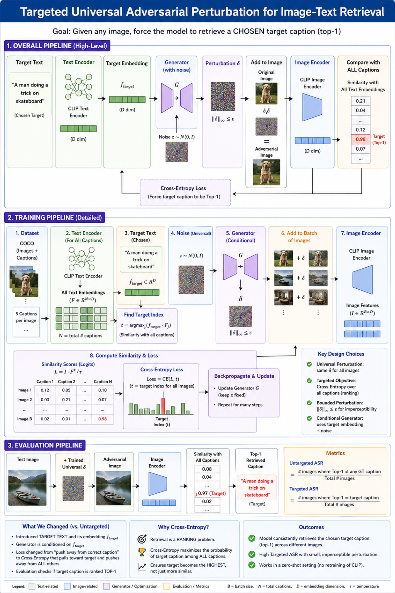

# Targeted Universal Adversarial Perturbation for Vision-Language Models
This project presents a targeted universal adversarial attack on vision-language pre-trained (VLP) models. Unlike prior untargeted approaches, our method aims to force the model to retrieve a chosen target caption for any input image.

[ICCV 2025] A PyTorch official implementation for [One Perturbation is Enough: On Generating Universal Adversarial Perturbations against Vision-Language Pre-training Models](https://arxiv.org/abs/2406.05491).[Reference Paper]




# Key Idea

We generate a single universal perturbation (UAP) that, when added to any image, shifts its embedding toward a specific target caption in the multimodal feature space.

# 🔥 Contributions
✅ Introduced targeted attack formulation (not just untargeted)
✅ Designed a conditional generator guided by target text
✅ Replaced contrastive loss with cross-entropy based ranking loss
✅ Added distance loss (LDis) to push away from original features
✅ Evaluated using R@1, R@5, R@10 instead of only top-1

# 🏗️ Method Overview
Encode target text → embedding
Generate perturbation using:
latent noise z
target text embedding
Add perturbation to image
Encode adversarial image
Compare with all captions
Optimize to push target caption to top

# ⚙️ Loss Function

We use a composite loss:

Components:
Cross-Entropy Loss
Pulls prediction toward target caption
Distance Loss
Pushes adversarial features away from clean image
Regularization
Keeps perturbation small

# 📊 Evaluation Metrics
Untargeted ASR
% images where original caption is no longer top-1
Targeted R@1
% images where target becomes top-1
Targeted R@5 / R@10
% images where target appears in top-K
 
## Setup
### Install dependencies
We provide the environment configuration file exported by Anaconda, which can help you build up conveniently.
```bash
conda env create -f environment.yml
conda activate CPGC
```  
### Prepare datasets and models

- Download the datasets, [Flickr30K](https://shannon.cs.illinois.edu/DenotationGraph/), [MSCOCO](https://cocodataset.org/#home), and fill the `image_root` in the configuration files.

# ⚠️ Limitations
Targeted R@1 remains low
Performance depends on target caption frequency
Transferability across models is limited

# 🔮 Future Work
Improve targeted success using contrastive + ranking hybrid loss
Explore multi-target attacks
Enhance black-box transferability
Apply to real-world retrieval systems

[ICCV 2025] A PyTorch official implementation for [One Perturbation is Enough: On Generating Universal Adversarial Perturbations against Vision-Language Pre-training Models](https://arxiv.org/abs/2406.05491).[Reference Paper]
